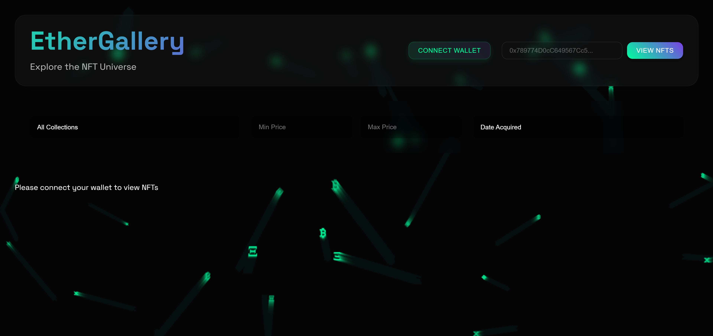

# EtherGallery - Modern NFT Portfolio Viewer



## 📑 Table of Contents
- [Overview](#-overview)
- [Features](#-features)
- [SDG Impact](#-sdg-impact)
- [Technologies](#️-technologies)
- [Quick Start](#️-quick-start)
- [Project Structure](#-project-structure)
- [Configuration](#-configuration)
- [Deployment](#-deployment)
- [Features Detail](#-features-detail)
- [Sustainability Impact](#-sustainability-impact)
- [Contributing](#-contributing)
- [License](#-license)
- [Contact](#-contact)

## 🚀 Overview

EtherGallery is a cutting-edge dApp revolutionizing how users explore and manage NFT collections across Ethereum wallets. Built with React and Web3.js, it offers a seamless experience with a stunning crypto-themed UI.

## ✨ Features

| Feature | Description |
|---------|-------------|
| 🔗 Wallet Integration | Seamless MetaMask connection and management |
| 🖼️ NFT Visualization | View NFTs from any Ethereum address |
| 🔍 Smart Filtering | Advanced sorting and filtering capabilities |
| 💫 Modern UI | Animated crypto-themed interface |
| 📱 Responsive | Full mobile and desktop support |
| ⚡ Real-time Data | Live OpenSea data integration |

## 🎯 SDG Impact

| SDG | Contribution |
|-----|-------------|
| SDG 9: Innovation | Building resilient blockchain infrastructure |
| SDG 8: Economic Growth | Enabling digital asset ownership |
| SDG 17: Partnerships | Enhancing technological collaboration |

## 🛠️ Technologies

| Category | Technologies Used |
|----------|------------------|
| Frontend | React.js, CSS3 Animations |
| Blockchain | Web3.js, MetaMask |
| APIs | OpenSea API |
| Deployment | GitHub Pages |

## 🏃‍♂️ Quick Start

1. Clone and enter:
   ```bash
   git clone https://github.com/ascender1729/EtherGallery.git
   cd EtherGallery
   ```

2. Install dependencies:
   ```bash
   npm install
   ```

3. Configure environment:
   ```bash
   echo "REACT_APP_OPENSEA_API_KEY=your_key_here" > .env
   ```

4. Launch:
   ```bash
   npm start
   ```

## 📁 Project Structure

```
EtherGallery/
├── 📂 public/
├── 📂 src/
│   ├── 📂 components/
│   │   ├── AddressSearch.jsx
│   │   ├── CryptoBackground.jsx
│   │   ├── FilterBar.jsx
│   │   ├── LoadingSpinner.jsx
│   │   ├── NFTCard.jsx
│   │   ├── NFTGrid.jsx
│   │   └── WalletConnect.jsx
│   ├── 📂 services/
│   ├── 📂 styles/
│   ├── App.jsx
│   └── index.js
└── package.json
```

## 🌍 Sustainability Impact

| Impact Area | Description |
|-------------|-------------|
| Digital Innovation | Promoting blockchain infrastructure |
| Economic Growth | Supporting creator economy |
| Technology Access | Making NFT technology accessible |

## 🔧 Configuration

1. OpenSea Setup:
   - Obtain API key: [OpenSea API](https://opensea.io/account/settings/api)
   - Add to .env file

2. MetaMask Setup:
   - Install extension: [MetaMask](https://metamask.io/)
   - Configure wallet

## 🚀 Deployment

1. Configure package.json:
   ```json
   {
     "homepage": "https://ascender1729.github.io/EtherGallery"
   }
   ```

2. Deploy:
   ```bash
   npm run deploy
   ```

## 🎨 Features Detail

| Feature | Implementation |
|---------|---------------|
| NFT Display | Responsive grid with animations |
| Wallet Integration | Real-time MetaMask connection |
| Filtering | Collection and price-based filters |

## 🤝 Contributing

1. Fork repository
2. Create feature branch
3. Commit changes
4. Open pull request

## 📝 License

MIT License - See [LICENSE](LICENSE) file

## 📞 Contact

- GitHub: [@ascender1729](https://github.com/ascender1729)
- Project: [EtherGallery Repository](https://github.com/ascender1729/EtherGallery)
- Live Demo: [EtherGallery App](https://ascender1729.github.io/EtherGallery)
